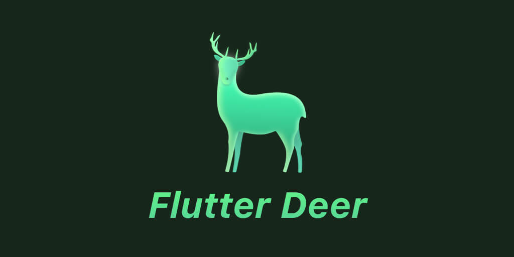

<!--
 * @Author: zdd
 * @Date: 2023-04-09 15:00:36
 * @LastEditors: zdd
 * @LastEditTime: 2023-04-09 22:24:56
 * @FilePath: /flutter_deer/README.md
 * @Description: 
-->
# Flutter Deer

## [English](README-EN.md) | 中文

本项目为个人学习Flutter的练习项目。

## 项目运行环境

    1. Flutter version 3.7.5

    2. Dart version 2.19.2

## Thanks For

- [flutter_deer](https://github.com/simplezhli/flutter_deer)

## License

	Copyright 2019 jimmyzhao

    Licensed under the Apache License, Version 2.0 (the "License");
    you may not use this file except in compliance with the License.
    You may obtain a copy of the License at

       https://www.apache.org/licenses/LICENSE-2.0

    Unless required by applicable law or agreed to in writing, software
    distributed under the License is distributed on an "AS IS" BASIS,
    WITHOUT WARRANTIES OR CONDITIONS OF ANY KIND, either express or implied.
    See the License for the specific language governing permissions and
    limitations under the License.
